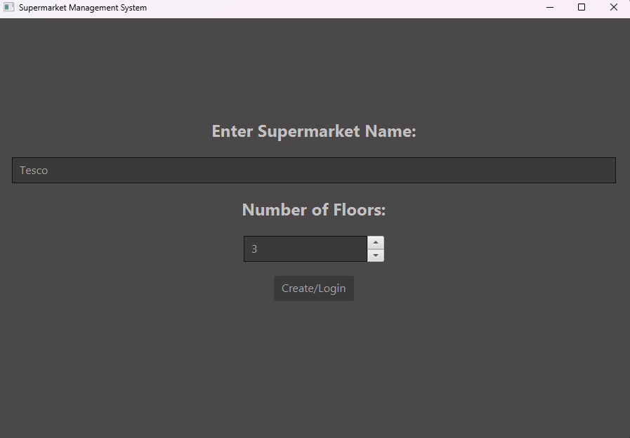
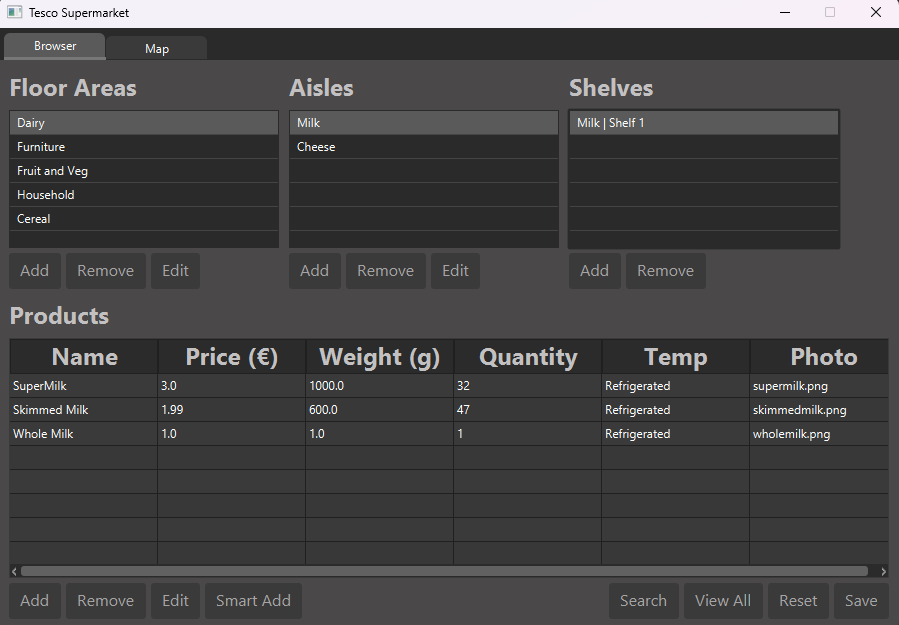
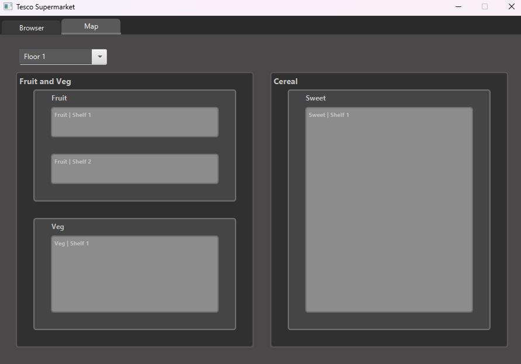

# Supermarket-Management-System
A JavaFX-based supermarket management system that allows users to design and manage a multi-floor supermarket layout, including floor areas, aisles, shelves, and products.  This project was made without Java Collections and instead uses a custom linked list. The system also supports full CRUD operations and persistent storage using XML.

---

## Overview

This project is a desktop application built in Java using JavaFX and CSS. It allows users to model a real-world supermarket structure and manage it through a graphical interface.

A key constraint of the project is that **all hierarchical data is stored using a custom linked list implementation**, rather than built-in Java collections such as `ArrayList` or `HashMap`.

---

## Features

- Create, edit, and delete:
  - Supermarkets
  - Floors
  - Floor areas
  - Aisles
  - Shelves
  - Products
- Fully hierarchical structure
- JavaFX GUI with CSS styling
- XML-based persistence for saving and loading supermarket data
- Visual floor map per floor
- Custom linked list implementation
- Smart product placement algorithm
- Partial and keyword-based product search
- View all products with aggregated values per aisle and floor area
- Reset functionality to restore the supermarket to its initial state

### Smart Add Algorithm
The system includes a smart add feature that automatically places products in the most appropriate location within the supermarket.

The algorithm:
- Detects identical products and merges quantities instead of duplicating entries
- Uses token-based partial string matching to compare product names
- Prioritizes aisles with matching temperature requirements (Room, Refrigerated, Frozen)
- Scores similarity between product names, aisle names, and existing products
- Dynamically selects or creates the most suitable shelf

This allows products to be added efficiently without requiring manual placement.

Implementation details can be found in the controller logic.

---

## Persistence

- The application supports saving and loading supermarket data using XML files.
- All supermarket data (floors, areas, aisles, shelves, products) is serialized to XML.
- On application startup, users can load an existing supermarket or create a new one.

---

## Floor Map Visualization

- Each floor includes a visual map view.
- The map displays:
  - Floor areas
  - Aisles within each area
  - Shelves within aisles
- The map updates dynamically when layout changes are made.

## How to Run

1. Clone the repository:
    ```bash
    git clone https://github.com/LorcanBrophy/Supermarket-Management-System.git

2. Open the project in your IDE (IntelliJ IDEA / Eclipse recommended)

3. Ensure JavaFX is properly configured

4. Run the main application class

--

## Screenshots

### Startup Screen


### Main Menu


### Floor Map Visualization


---

## Technologies Used

- **Java**
- **JavaFX** (GUI)
- **CSS** (UI styling)
- **XML** (Data persistence)
